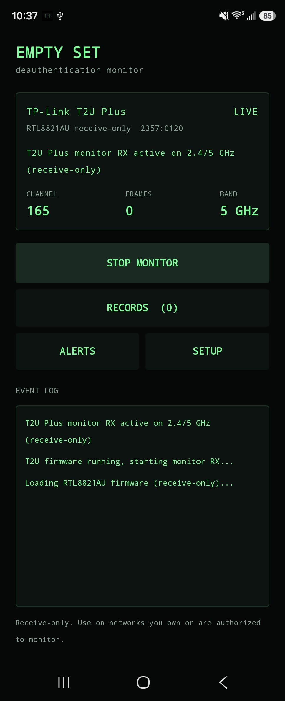
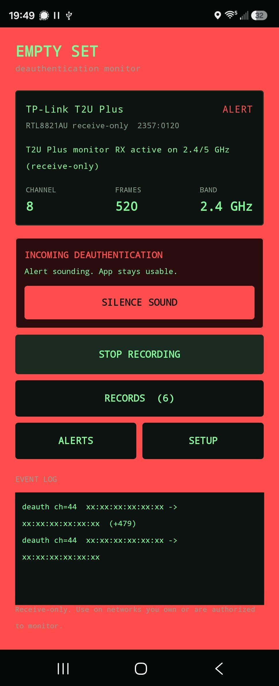
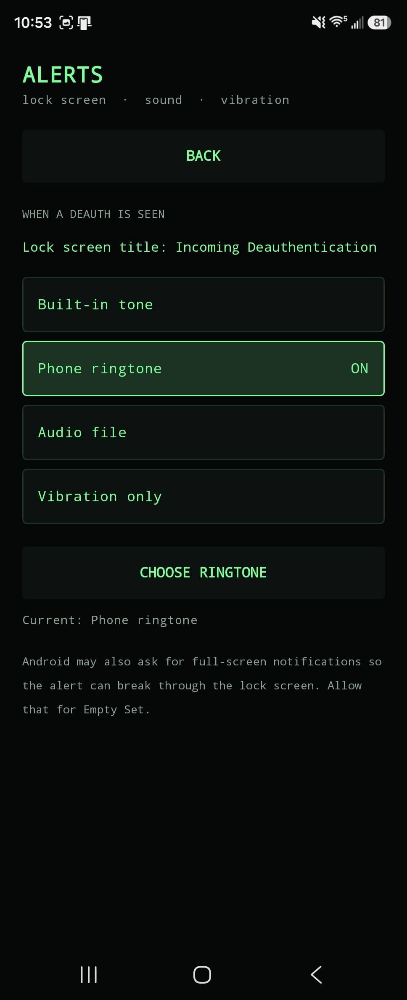
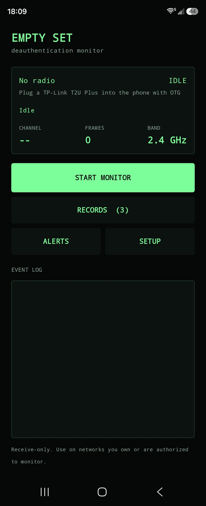
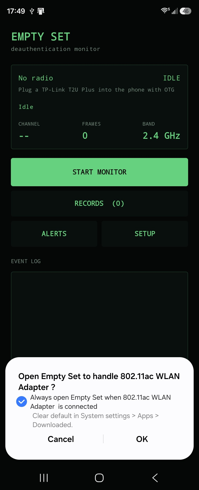

# Empty Set

Receive-only deauthentication monitor for Android.

Empty Set watches 2.4 GHz and 5 GHz Wi-Fi for deauthentication and disassociation frames, then raises an **Incoming Deauthentication** alert. It never transmits, never injects packets, and never sends deauth frames. Use it only on networks you own or are authorized to monitor.

<p align="center">
  
</p>

## Screenshots

<p>
  
  
  
</p>
<p>
  
  
</p>

## Download

A debug APK is in this repository:

- [dist/EmptySet-0.3.1-debug.apk](dist/EmptySet-0.3.1-debug.apk) (arm64-v8a, Android 8.0+)

Install it, allow notifications, plug in a supported USB adapter over OTG, accept the USB prompt, then tap **Start Monitor**.

On Android 14+, also allow full-screen / lock-screen notifications if you want Incoming Deauthentication to appear over the lock screen.

## What it does

- Passively sniffs 802.11 deauth and disassoc frames with an external USB adapter
- Hops both 2.4 GHz and 5 GHz
- Shows a live event log and a lock-screen **Incoming Deauthentication** alert
- Lets you silence the sound while recording continues, or stop recording during a continuous attack
- Saves each attempt as `Deauth Notification yyyy-MM-dd HH-mm-ss` (JSON and CSV) in Downloads and in the app Documents folder
- Night UI throughout

Alert sound options:

- Built-in tone
- Phone ringtone
- Custom audio file
- Vibration only

## Hardware

Current capture path:

| Adapter | Chip | USB ID |
| --- | --- | --- |
| TP-Link Archer T2U Plus | RTL8821AU | `2357:0120` |

You also need:

1. A 64-bit (arm64) Android phone with USB-C OTG (USB **host**, not “controlled by connected device”)
2. A USB-C OTG cable or hub. A powered hub helps if the dongle browns out
3. Notifications (and lock-screen full-screen intent, if you want the overlay)

If the stick first appears as a flash drive (Realtek ZeroCD, `0bda:1a2b`), unplug, wait, and replug until it enumerates as `2357:0120`.

Panda Wireless PAU0A (MediaTek MT7610U) support is planned. It needs a separate receive-only backend; it cannot reuse the T2U driver.

## How capture works

Android has no public 802.11 monitor-mode API. Empty Set opens the USB device as host, hands the file descriptor to a receive-only userspace driver, loads firmware, hops channels, and parses deauth/disassoc frames.

- [OpenIPC devourer](https://github.com/OpenIPC/devourer) (GPL-2.0), Jaguar1 / RTL8821AU only
- [libusb](https://github.com/libusb/libusb) 1.0.27 (LGPL-2.1), linked shared

No root. Transmit and packet-injection APIs are not used.

## Build from source

Need Android SDK 34, NDK r30, and CMake 3.22.1.

```bat
gradlew.bat assembleDebug
```

APK output:

```
app\build\outputs\apk\debug\app-debug.apk
```

## License

Empty Set is **GNU GPL v2** because it links devourer. See [LICENSE](LICENSE) and [NOTICE](NOTICE).

libusb remains LGPL-2.1 (`third_party/libusb`). Corresponding source for devourer is vendored in `third_party/devourer`.

## Authorized use

This is a detector, not an attack tool. Do not use it to disrupt other people’s networks.
